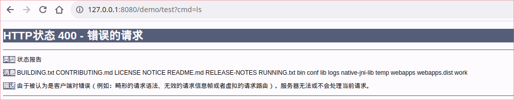
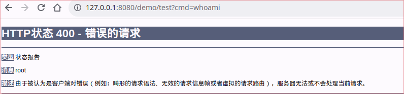

# crack java agent

不落地文件，不借助 `VM.attach` 而实现的 `Agent` 型内存马。技术细节: [Agent 内存马的攻防之道](https://xz.aliyun.com/t/13110#toc-0)。

注意：本项目仅做学习研究使用，不保证其稳定性及可靠性。本项目不应该在生产环境下使用，也不应该用于任何非法或不道德的目的。使用本项目的人应严格遵守相关的法律法规，对自己的行为负责。

## app

测试应用，模拟受害者的 java 应用：

```bash
cd app
mvn clean package
java -cp target/app-1.0-SNAPSHOT.jar com.rzte.agentcrack.App
```

## javaagent-monitor

敏感类监控，模拟防护软件，与测试应用 `app` 配合测试。

```bash
export workdir=`pwd`
cd javaagent-monitor
mvn clean package

# 1. 防守模式运行目标应用
java -javaagent:${workdir}/javaagent-monitor/target/javaagent-monitor-1.0-SNAPSHOT-jar-with-dependencies.jar -cp ${workdir}/app/target/app-1.0-SNAPSHOT.jar com.rzte.agentcrack.App

# 2. 临时检测模式
java -jar ./target/javaagent-monitor-1.0-SNAPSHOT-jar-with-dependencies.jar <app_pid>

# 若找不到 VirtualMachine 可手动指定 tools.jar
java -Xbootclasspath/a:${JAVA_HOME}/lib/tools.jar -jar ./target/javaagent-monitor-1.0-SNAPSHOT-jar-with-dependencies.jar <app_pid>
```

## javaagent-hack

简单的攻击示意，与测试应用 `app` 配合测试。

```bash
cd javaagent-hack
mvn clean package


java -jar javaagent.jar <target_pid> redefine/retransform
```

## memshell-demo

内存马示意，与测试应用 `app` 配合测试。

- `NoAgent`
    简单的，不落地文件，借助已有的 agent 实施攻击
- `AgentA`
    不借助 agent，不落地文件，创建新的 agent 后实施攻击。目前仅适配了 `jdk8`。
- `AgentB`
    基于 `AgentA`，但所使用的类，不再需要实现 `ClassFileTransformer`，也无需使用 `ClassFileTransformer.transform` 方法。
- `AgentX`
    基于 `AgentB`，但是不再会被 `java agent` 技术所检测到或是清除掉

可在编译后，直接在 `App` 运行时，加载对应的“攻击类”：

```shell
java -cp ${workdir}/app/target/app-1.0-SNAPSHOT.jar:${workdir}/memshell-demo/ com.rzte.agentcrack.App  AgentX
```

## memshell-server

与下面的 `memshell` 配合，负责初始化内存马。

```bash
java -cp ${workdir}/memshell-server/target/memshell-server-1.0-SNAPSHOT-jar-with-dependencies.jar com.rzte.agentcrack.App
Usage: java -cp memshell-server.jar com.rzte.agentcrack.App <target_url>

Example:

java -cp ${workdir}/memshell-server/target/memshell-server-1.0-SNAPSHOT-jar-with-dependencies.jar com.rzte.agentcrack.App http://127.0.0.1:8080/demo/NoAgent.jsp
```

之后，便可以通过 `cmd` 参数向任意路径发送命令:






## memshell

根据 `memshell-demo` 而实现的，相对“实际”的 `jsp` 内存马。由于 `jsp` 中修改类字节码比较复杂，这里借助 `memshell-server` 来修改 。

### NoAgent.jsp

无需落地文件，借助已有的 agent 实施攻击:


### AgentX.jsp

无需落地文件，也不借助已有的 agent 实施攻击，且基本上无法被基于 `java agent` 技术而实现的防护措施所检测到（目前仅适配了 64 位的 jdk8 ）。

